# Entity Relationship Diagram - Timesheet Management System

## Complete Database Schema ER Diagram

This document contains the complete Entity Relationship (ER) Diagram for the Timesheet Management System database, showing all entities, their attributes, primary keys, foreign keys, and relationships.

```mermaid
erDiagram
    %% ============================================
    %% CORE ENTITIES
    %% ============================================
    
    USERS {
        VARCHAR_36 id PK
        VARCHAR_50 employee_id UK "UNIQUE"
        VARCHAR_255 office365_id UK "UNIQUE"
        VARCHAR_255 email UK "UNIQUE"
        VARCHAR_255 name
        VARCHAR_100 department
        VARCHAR_100 job_title
        VARCHAR_36 manager_id FK
        BOOLEAN is_admin
        BOOLEAN is_project_manager
        BOOLEAN is_active
        TIMESTAMP office365_synced_at
        TIMESTAMP created_at
        TIMESTAMP updated_at
    }
    
    CLIENTS {
        VARCHAR_36 id PK
        VARCHAR_50 client_code UK "UNIQUE"
        VARCHAR_255 name
        ENUM type "client|internal"
        VARCHAR_100 industry
        VARCHAR_255 contact_person
        VARCHAR_255 contact_email
        VARCHAR_50 contact_phone
        TEXT address
        BOOLEAN is_active
        TIMESTAMP created_at
        TIMESTAMP updated_at
    }
    
    PROJECTS {
        VARCHAR_36 id PK
        VARCHAR_50 project_code UK "UNIQUE"
        VARCHAR_255 name
        TEXT description
        VARCHAR_36 client_id FK
        VARCHAR_36 project_manager_id FK
        DATE start_date
        DATE end_date
        INT estimated_hours
        ENUM status "active|on-hold|completed|cancelled"
        ENUM priority "low|medium|high|critical"
        BOOLEAN is_billable
        TIMESTAMP created_at
        TIMESTAMP updated_at
    }
    
    PROJECT_TEAM_MEMBERS {
        VARCHAR_36 id PK
        VARCHAR_36 project_id FK
        VARCHAR_36 user_id FK
        VARCHAR_50 role
        INT allocated_hours
        TIMESTAMP joined_at
        TIMESTAMP left_at
        BOOLEAN is_active
    }
    
    TIMESHEETS {
        VARCHAR_36 id PK
        VARCHAR_50 timesheet_code UK "UNIQUE"
        VARCHAR_36 user_id FK
        INT year
        INT month
        DECIMAL_6_2 total_hours
        INT total_working_days
        INT total_holidays
        INT total_leaves
        ENUM status "draft|submitted|approved|rejected|revision_required"
        TIMESTAMP submitted_at
        TIMESTAMP created_at
        TIMESTAMP updated_at
    }
    
    TIMESHEET_ENTRIES {
        VARCHAR_36 id PK
        VARCHAR_36 timesheet_id FK
        VARCHAR_36 project_id FK
        DATE entry_date
        DECIMAL_4_2 hours
        TEXT task_description
        BOOLEAN is_holiday
        BOOLEAN is_leave
        VARCHAR_20 leave_type "half-day|full-day|NULL"
        TINYINT_1 is_halfday
        BOOLEAN is_weekend
        TIMESTAMP created_at
        TIMESTAMP updated_at
    }
    
    APPROVALS {
        VARCHAR_36 id PK
        VARCHAR_36 timesheet_id FK
        VARCHAR_36 project_id FK
        VARCHAR_36 project_manager_id FK
        ENUM status "pending|approved|rejected"
        DECIMAL_6_2 total_hours
        TEXT comments
        TIMESTAMP approved_at
        TIMESTAMP rejected_at
        TIMESTAMP created_at
        TIMESTAMP updated_at
    }
    
    LEAVES {
        VARCHAR_36 id PK
        VARCHAR_36 user_id FK
        VARCHAR_50 leave_type
        DATE start_date
        DATE end_date
        INT total_days
        TEXT reason
        ENUM status "pending|approved|rejected|cancelled"
        DATE applied_date
        VARCHAR_255 approved_by
        VARCHAR_255 hrone_id
        TIMESTAMP hrone_synced_at
        TIMESTAMP created_at
        TIMESTAMP updated_at
    }
    
    HOLIDAYS {
        VARCHAR_36 id PK
        DATE date UK "UNIQUE"
        VARCHAR_255 title
        TEXT description
        ENUM type "public|optional|regional"
        BOOLEAN is_optional
        VARCHAR_255 hrone_id
        TIMESTAMP hrone_synced_at
        TIMESTAMP created_at
        TIMESTAMP updated_at
    }
    
    PROJECT_ACCESS_REQUESTS {
        VARCHAR_36 id PK
        VARCHAR_36 user_id FK
        TEXT request_message
        ENUM status "pending|approved|rejected|completed"
        TEXT admin_response
        VARCHAR_36 responded_by FK
        TIMESTAMP responded_at
        TIMESTAMP created_at
        TIMESTAMP updated_at
    }
    
    AUDIT_LOGS {
        VARCHAR_36 id PK
        VARCHAR_36 user_id FK
        VARCHAR_50 action
        VARCHAR_50 entity_type
        VARCHAR_36 entity_id
        JSON old_values
        JSON new_values
        VARCHAR_45 ip_address
        TEXT user_agent
        TIMESTAMP created_at
    }
    
    SYSTEM_CONFIGURATIONS {
        VARCHAR_36 id PK
        VARCHAR_100 category
        VARCHAR_255 config_key UK "UNIQUE"
        TEXT config_value
        TEXT description
        BOOLEAN is_secret
        VARCHAR_36 updated_by FK
        TIMESTAMP created_at
        TIMESTAMP updated_at
    }
    
    SYNC_LOGS {
        VARCHAR_36 id PK
        ENUM source "office365|hrone"
        VARCHAR_50 sync_type
        ENUM status "success|partial|failed"
        INT records_fetched
        INT records_created
        INT records_updated
        INT records_failed
        TEXT error_message
        JSON sync_details
        TIMESTAMP started_at
        TIMESTAMP completed_at
        INT duration_seconds
    }
    
    %% ============================================
    %% RELATIONSHIPS
    %% ============================================
    
    %% User Self-Referencing (Manager Hierarchy)
    USERS ||--o{ USERS : "manages (manager_id)"
    
    %% Client to Projects (One-to-Many)
    CLIENTS ||--o{ PROJECTS : "has"
    
    %% User to Projects (Project Manager - One-to-Many)
    USERS ||--o{ PROJECTS : "manages (project_manager_id)"
    
    %% Projects to Team Members (Many-to-Many via Junction Table)
    PROJECTS ||--o{ PROJECT_TEAM_MEMBERS : "has"
    USERS ||--o{ PROJECT_TEAM_MEMBERS : "assigned_to"
    
    %% User to Timesheets (One-to-Many)
    USERS ||--o{ TIMESHEETS : "submits"
    
    %% Timesheets to Timesheet Entries (One-to-Many)
    TIMESHEETS ||--o{ TIMESHEET_ENTRIES : "contains"
    
    %% Projects to Timesheet Entries (One-to-Many)
    PROJECTS ||--o{ TIMESHEET_ENTRIES : "logged_in"
    
    %% Timesheets to Approvals (One-to-Many)
    TIMESHEETS ||--o{ APPROVALS : "requires"
    
    %% Projects to Approvals (One-to-Many)
    PROJECTS ||--o{ APPROVALS : "requires_approval_for"
    
    %% Users to Approvals (Project Manager - One-to-Many)
    USERS ||--o{ APPROVALS : "approves (project_manager_id)"
    
    %% Users to Leaves (One-to-Many)
    USERS ||--o{ LEAVES : "takes"
    
    %% Users to Project Access Requests (One-to-Many)
    USERS ||--o{ PROJECT_ACCESS_REQUESTS : "requests"
    
    %% Users to Project Access Requests (Admin Responder - One-to-Many)
    USERS ||--o{ PROJECT_ACCESS_REQUESTS : "responds_to (responded_by)"
    
    %% Users to Audit Logs (One-to-Many)
    USERS ||--o{ AUDIT_LOGS : "performs"
    
    %% Users to System Configurations (One-to-Many)
    USERS ||--o{ SYSTEM_CONFIGURATIONS : "updates (updated_by)"
```

## Relationship Summary

### One-to-Many Relationships

1. **Users → Users** (Self-referencing)
   - A user can have one manager (manager_id)
   - A manager can manage multiple users
   - **Cardinality**: 1:0..N (optional)

2. **Clients → Projects**
   - One client can have many projects
   - Each project belongs to one client
   - **Cardinality**: 1:N

3. **Users → Projects** (as Project Manager)
   - One user (project manager) can manage many projects
   - Each project has one project manager
   - **Cardinality**: 1:N

4. **Users → Timesheets**
   - One user can submit many timesheets
   - Each timesheet belongs to one user
   - **Cardinality**: 1:N

5. **Timesheets → Timesheet Entries**
   - One timesheet contains many entries
   - Each entry belongs to one timesheet
   - **Cardinality**: 1:N

6. **Projects → Timesheet Entries**
   - One project can have many timesheet entries
   - Each entry is logged for one project
   - **Cardinality**: 1:N

7. **Timesheets → Approvals**
   - One timesheet can have many approvals (one per project)
   - Each approval is for one timesheet
   - **Cardinality**: 1:N

8. **Projects → Approvals**
   - One project can have many approvals
   - Each approval is for one project
   - **Cardinality**: 1:N

9. **Users → Approvals** (as Project Manager)
   - One project manager can approve many timesheets
   - Each approval is made by one project manager
   - **Cardinality**: 1:N

10. **Users → Leaves**
    - One user can take many leaves
    - Each leave belongs to one user
    - **Cardinality**: 1:N

11. **Users → Project Access Requests** (as Requester)
    - One user can make many access requests
    - Each request is made by one user
    - **Cardinality**: 1:N

12. **Users → Project Access Requests** (as Responder)
    - One admin can respond to many requests
    - Each request can be responded to by one admin
    - **Cardinality**: 1:0..N (optional)

13. **Users → Audit Logs**
    - One user can generate many audit logs
    - Each audit log can be associated with one user (optional)
    - **Cardinality**: 1:0..N (optional)

14. **Users → System Configurations** (as Updater)
    - One user can update many configurations
    - Each configuration can be updated by one user (optional)
    - **Cardinality**: 1:0..N (optional)

### Many-to-Many Relationships

1. **Users ↔ Projects** (via PROJECT_TEAM_MEMBERS)
   - Many users can be assigned to many projects
   - Many projects can have many team members
   - **Junction Table**: PROJECT_TEAM_MEMBERS
   - **Cardinality**: M:N

### Standalone Entities

1. **Holidays**
   - No foreign key relationships
   - Referenced logically by timesheet entries (is_holiday flag)

2. **Sync Logs**
   - No foreign key relationships
   - Tracks synchronization operations from external systems

## Key Constraints

### Unique Constraints
- `users.employee_id` - UNIQUE
- `users.office365_id` - UNIQUE
- `users.email` - UNIQUE
- `clients.client_code` - UNIQUE
- `projects.project_code` - UNIQUE
- `timesheets.timesheet_code` - UNIQUE
- `timesheets(user_id, year, month)` - UNIQUE (one timesheet per user per month)
- `project_team_members(project_id, user_id)` - UNIQUE (one membership per user per project)
- `holidays.date` - UNIQUE
- `system_configurations.config_key` - UNIQUE

### Foreign Key Constraints

All foreign keys use appropriate referential actions:
- **ON DELETE CASCADE**: Used for dependent records (timesheets, entries, team members, leaves, etc.)
- **ON DELETE RESTRICT**: Used for critical relationships (projects to clients, projects to managers)
- **ON DELETE SET NULL**: Used for optional relationships (manager_id, responded_by, updated_by)

## Workflow Representation

The ER diagram represents the following key workflows:

1. **Timesheet Submission Flow**:
   - User → Timesheet → Timesheet Entries → Projects
   - Timesheet → Approvals → Project Manager

2. **Project Assignment Flow**:
   - Client → Projects → Project Team Members → Users
   - Users can request project access via Project Access Requests

3. **Leave Management Flow**:
   - Users → Leaves (tracked separately)
   - Leaves reflected in Timesheet Entries (is_leave flag)

4. **Holiday Management**:
   - Holidays tracked independently
   - Referenced in Timesheet Entries (is_holiday flag)

5. **Approval Workflow**:
   - Timesheets require approvals per project
   - Project Managers approve entries for their projects

6. **Audit and Sync Tracking**:
   - All user actions logged in Audit Logs
   - External system syncs tracked in Sync Logs

## Notes

- **Primary Keys**: All tables use VARCHAR(36) UUIDs as primary keys
- **Timestamps**: Most tables include `created_at` and `updated_at` for audit purposes
- **Soft Deletes**: Some tables use `is_active` flags instead of hard deletes
- **Status Fields**: Multiple tables use ENUM types for status tracking
- **External Integration**: Tables include fields for Office365 and HRone integration (office365_id, hrone_id, sync timestamps)

