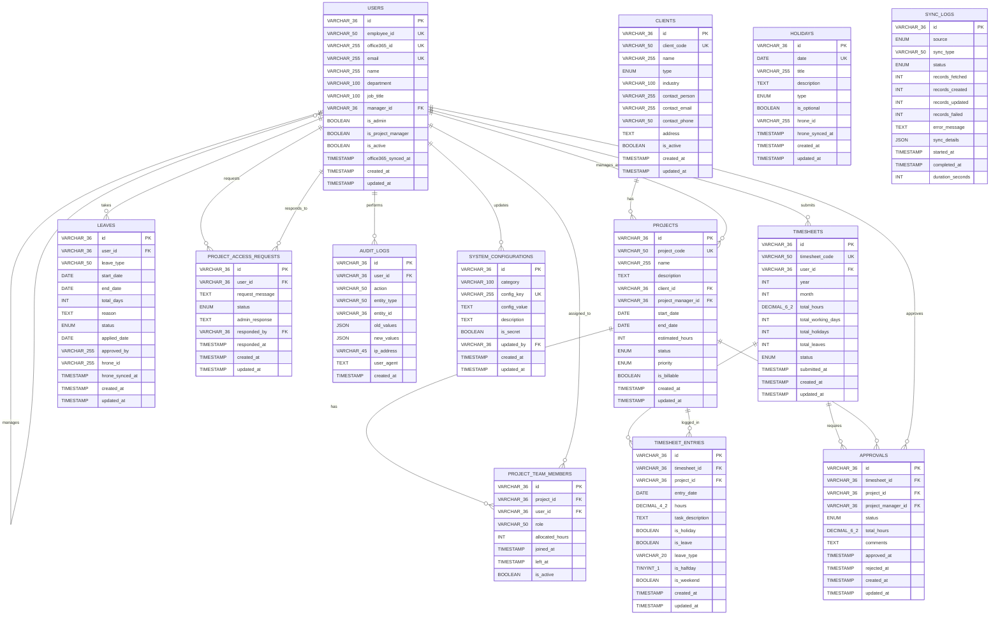

```mermaid
erDiagram
    USERS {
        VARCHAR_36 id PK
        VARCHAR_50 employee_id UK
        VARCHAR_255 office365_id UK
        VARCHAR_255 email UK
        VARCHAR_255 name
        VARCHAR_100 department
        VARCHAR_100 job_title
        VARCHAR_36 manager_id FK
        BOOLEAN is_admin
        BOOLEAN is_project_manager
        BOOLEAN is_active
        TIMESTAMP office365_synced_at
        TIMESTAMP created_at
        TIMESTAMP updated_at
    }
    
    CLIENTS {
        VARCHAR_36 id PK
        VARCHAR_50 client_code UK
        VARCHAR_255 name
        ENUM type
        VARCHAR_100 industry
        VARCHAR_255 contact_person
        VARCHAR_255 contact_email
        VARCHAR_50 contact_phone
        TEXT address
        BOOLEAN is_active
        TIMESTAMP created_at
        TIMESTAMP updated_at
    }
    
    PROJECTS {
        VARCHAR_36 id PK
        VARCHAR_50 project_code UK
        VARCHAR_255 name
        TEXT description
        VARCHAR_36 client_id FK
        VARCHAR_36 project_manager_id FK
        DATE start_date
        DATE end_date
        INT estimated_hours
        ENUM status
        ENUM priority
        BOOLEAN is_billable
        TIMESTAMP created_at
        TIMESTAMP updated_at
    }
    
    PROJECT_TEAM_MEMBERS {
        VARCHAR_36 id PK
        VARCHAR_36 project_id FK
        VARCHAR_36 user_id FK
        VARCHAR_50 role
        INT allocated_hours
        TIMESTAMP joined_at
        TIMESTAMP left_at
        BOOLEAN is_active
    }
    
    TIMESHEETS {
        VARCHAR_36 id PK
        VARCHAR_50 timesheet_code UK
        VARCHAR_36 user_id FK
        INT year
        INT month
        DECIMAL_6_2 total_hours
        INT total_working_days
        INT total_holidays
        INT total_leaves
        ENUM status
        TIMESTAMP submitted_at
        TIMESTAMP created_at
        TIMESTAMP updated_at
    }
    
    TIMESHEET_ENTRIES {
        VARCHAR_36 id PK
        VARCHAR_36 timesheet_id FK
        VARCHAR_36 project_id FK
        DATE entry_date
        DECIMAL_4_2 hours
        TEXT task_description
        BOOLEAN is_holiday
        BOOLEAN is_leave
        VARCHAR_20 leave_type
        TINYINT_1 is_halfday
        BOOLEAN is_weekend
        TIMESTAMP created_at
        TIMESTAMP updated_at
    }
    
    APPROVALS {
        VARCHAR_36 id PK
        VARCHAR_36 timesheet_id FK
        VARCHAR_36 project_id FK
        VARCHAR_36 project_manager_id FK
        ENUM status
        DECIMAL_6_2 total_hours
        TEXT comments
        TIMESTAMP approved_at
        TIMESTAMP rejected_at
        TIMESTAMP created_at
        TIMESTAMP updated_at
    }
    
    LEAVES {
        VARCHAR_36 id PK
        VARCHAR_36 user_id FK
        VARCHAR_50 leave_type
        DATE start_date
        DATE end_date
        INT total_days
        TEXT reason
        ENUM status
        DATE applied_date
        VARCHAR_255 approved_by
        VARCHAR_255 hrone_id
        TIMESTAMP hrone_synced_at
        TIMESTAMP created_at
        TIMESTAMP updated_at
    }
    
    HOLIDAYS {
        VARCHAR_36 id PK
        DATE date UK
        VARCHAR_255 title
        TEXT description
        ENUM type
        BOOLEAN is_optional
        VARCHAR_255 hrone_id
        TIMESTAMP hrone_synced_at
        TIMESTAMP created_at
        TIMESTAMP updated_at
    }
    
    PROJECT_ACCESS_REQUESTS {
        VARCHAR_36 id PK
        VARCHAR_36 user_id FK
        TEXT request_message
        ENUM status
        TEXT admin_response
        VARCHAR_36 responded_by FK
        TIMESTAMP responded_at
        TIMESTAMP created_at
        TIMESTAMP updated_at
    }
    
    AUDIT_LOGS {
        VARCHAR_36 id PK
        VARCHAR_36 user_id FK
        VARCHAR_50 action
        VARCHAR_50 entity_type
        VARCHAR_36 entity_id
        JSON old_values
        JSON new_values
        VARCHAR_45 ip_address
        TEXT user_agent
        TIMESTAMP created_at
    }
    
    SYSTEM_CONFIGURATIONS {
        VARCHAR_36 id PK
        VARCHAR_100 category
        VARCHAR_255 config_key UK
        TEXT config_value
        TEXT description
        BOOLEAN is_secret
        VARCHAR_36 updated_by FK
        TIMESTAMP created_at
        TIMESTAMP updated_at
    }
    
    SYNC_LOGS {
        VARCHAR_36 id PK
        ENUM source
        VARCHAR_50 sync_type
        ENUM status
        INT records_fetched
        INT records_created
        INT records_updated
        INT records_failed
        TEXT error_message
        JSON sync_details
        TIMESTAMP started_at
        TIMESTAMP completed_at
        INT duration_seconds
    }
    
    USERS ||--o{ USERS : "manages"
    CLIENTS ||--o{ PROJECTS : "has"
    USERS ||--o{ PROJECTS : "manages_as_pm"
    PROJECTS ||--o{ PROJECT_TEAM_MEMBERS : "has"
    USERS ||--o{ PROJECT_TEAM_MEMBERS : "assigned_to"
    USERS ||--o{ TIMESHEETS : "submits"
    TIMESHEETS ||--o{ TIMESHEET_ENTRIES : "contains"
    PROJECTS ||--o{ TIMESHEET_ENTRIES : "logged_in"
    TIMESHEETS ||--o{ APPROVALS : "requires"
    PROJECTS ||--o{ APPROVALS : "requires_approval_for"
    USERS ||--o{ APPROVALS : "approves"
    USERS ||--o{ LEAVES : "takes"
    USERS ||--o{ PROJECT_ACCESS_REQUESTS : "requests"
    USERS ||--o{ PROJECT_ACCESS_REQUESTS : "responds_to"
    USERS ||--o{ AUDIT_LOGS : "performs"
    USERS ||--o{ SYSTEM_CONFIGURATIONS : "updates"
```

